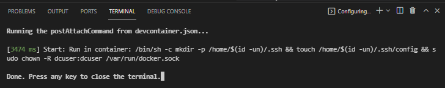

# Using Azure Identity to pull container image from Azure Container Registry
# Table of Contents
- [Using Azure Identity to pull container image from Azure Container Registry](#using-azure-identity-to-pull-container-image-from-azure-container-registry)
- [Table of Contents](#table-of-contents)
  - [Introduction](#introduction)
  - [Installing the pre-requisites](#installing-the-pre-requisites)
    - [Installing Git](#installing-git)
    - [Installing Docker and Visual Studio Code](#installing-docker-and-visual-studio-code)
  - [Installing the project](#installing-the-project)
    - [Clone the repository](#clone-the-repository)
    - [Launch Visual Studio Code with the dev container](#launch-visual-studio-code-with-the-dev-container)
  - [Running the REST APIs locally](#running-the-rest-apis-locally)
    - [Testing locally dotnet based REST API](#testing-locally-dotnet-based-rest-api)
  - [Running the REST APIs in a local container](#running-the-rest-apis-in-a-local-container)
    - [Testing dotnet REST API in a local container](#testing-dotnet-rest-api-in-a-local-container)
  - [Testing the Azure Container Registry authentication with a container in Azure App Service](#testing-the-azure-container-registry-authentication-with-a-container-in-azure-app-service)
    - [Testing the Azure Container Registry login/password authentication](#testing-the-azure-container-registry-loginpassword-authentication)
      - [Deploying the infrastructure](#deploying-the-infrastructure)
      - [Building the container image](#building-the-container-image)
    - [Testing the Azure Container Registry with System Assigned Identity authentication](#testing-the-azure-container-registry-with-system-assigned-identity-authentication)
      - [Deploying the infrastructure](#deploying-the-infrastructure-1)
      - [Building the container image](#building-the-container-image-1)
    - [Testing the Azure Container Registry with User Assigned Identity authentication](#testing-the-azure-container-registry-with-user-assigned-identity-authentication)
      - [Deploying the infrastructure](#deploying-the-infrastructure-2)
      - [Building the container image](#building-the-container-image-2)
    - [Testing the REST APIs](#testing-the-rest-apis)
  - [Next steps](#next-steps)

When containers are used for a deployment on Azure App Services oftentimes the container images are pulled from the Azure Container Registry using the following environment variables in the Azure App Service configuration:
DOCKER_REGISTRY_SERVER_URL
DOCKER_REGISTRY_SERVER_USERNAME
DOCKER_REGISTRY_SERVER_PASSWORD
The values of those variables which are secrets are usually stored in Azure Key Vault.
Using Azure Assigned System Identity or User Assigned Managed Identity associated with the Azure App Service it's possible to pull the image from Azure Container Registry without storing the password in a Key Vault. This sample will show how to use Identity to deploy container images on Azure App Services.

This sample will show how to deploy dotnet REST APIs container based running in the same Azure App Service using either System Assigned Identity or User Managed Assigned Identity.

## Introduction

This sample will show how to deploy dotnet REST APIs container based running in the same Azure App Service using either System Assigned Identity or User Managed Assigned Identity.

The dotnet REST API service will be defined with a Dockerfile. The services will be deployed to the Azure App Service using the AcrPull role to pull the image from Azure Container Registry.  

## Installing the pre-requisites

In order to deploy and test this solution we recommend to use Docker, Visual Studio Code with a dev container.
This chapter describes how to install Git, Docker and Visual Studio Code on Windows, MacOS and Linux.

### Installing Git

Git client will be required to clone the repository on your local machine. Git client can installed on Windows, MacOS, Linux.

[Installing Git on several platform](https://git-scm.com/book/en/v2/Getting-Started-Installing-Git)
### Installing Docker and Visual Studio Code

|[](https://www.docker.com/products/docker-desktop)|[](https://docs.docker.com/get-docker/)|[](https://www.docker.com/products/docker-desktop)|
| :--- | :--- | :--- |
| [Docker Desktop](https://www.docker.com/products/docker-desktop) 2.0+ on Windows 10 Pro/Enterprise. Windows 10 Home (2004+) requires Docker Desktop 2.3+ and the [WSL 2 back-end](https://docs.docker.com/desktop/windows/wsl/). (Docker Toolbox is not supported. Windows container images are not supported.) <br />[Visual Studio Code](https://code.visualstudio.com/docs/setup/windows)|  [Docker CE/EE](https://docs.docker.com/get-docker/) 18.06+ and [Docker Compose](https://docs.docker.com/compose/install/) 1.21+. (The Ubuntu snap package is not supported.) <br />[Visual Studio Code](https://code.visualstudio.com/docs/setup/linux) &nbsp;&nbsp; &nbsp;&nbsp; &nbsp;&nbsp; &nbsp;&nbsp; &nbsp;&nbsp; &nbsp;&nbsp; &nbsp;&nbsp; &nbsp;&nbsp; &nbsp;&nbsp; &nbsp;&nbsp; &nbsp;&nbsp; &nbsp;&nbsp; &nbsp;&nbsp; &nbsp;&nbsp; &nbsp;&nbsp; &nbsp;&nbsp; &nbsp;&nbsp; &nbsp;&nbsp; &nbsp;&nbsp; &nbsp;&nbsp; &nbsp;&nbsp; &nbsp;&nbsp; &nbsp; &nbsp;&nbsp; &nbsp;&nbsp; &nbsp;&nbsp; &nbsp;&nbsp; &nbsp;&nbsp; &nbsp;&nbsp; &nbsp;&nbsp; &nbsp;&nbsp; &nbsp;&nbsp; &nbsp;&nbsp; &nbsp;&nbsp; &nbsp;&nbsp; &nbsp;&nbsp; &nbsp;&nbsp; &nbsp;&nbsp; &nbsp;&nbsp; &nbsp;&nbsp; &nbsp;&nbsp; &nbsp;&nbsp; &nbsp;&nbsp; &nbsp;&nbsp; &nbsp;&nbsp; &nbsp;&nbsp; &nbsp;&nbsp; &nbsp;&nbsp; &nbsp;&nbsp; &nbsp;&nbsp; &nbsp;&nbsp; &nbsp;&nbsp; &nbsp;&nbsp; &nbsp;&nbsp; &nbsp;&nbsp; &nbsp;&nbsp; &nbsp;&nbsp; &nbsp;&nbsp; &nbsp;&nbsp; &nbsp;&nbsp; &nbsp; &nbsp;&nbsp; &nbsp;&nbsp; &nbsp;&nbsp; &nbsp;&nbsp; &nbsp;&nbsp; &nbsp;&nbsp; &nbsp;&nbsp; &nbsp;&nbsp; &nbsp;&nbsp; &nbsp;&nbsp; &nbsp;&nbsp; &nbsp;&nbsp; &nbsp;&nbsp; &nbsp;&nbsp; &nbsp;&nbsp; &nbsp;&nbsp; &nbsp;&nbsp; &nbsp;&nbsp; &nbsp;&nbsp; &nbsp;&nbsp; &nbsp;&nbsp; &nbsp;&nbsp; &nbsp;&nbsp; &nbsp;&nbsp; &nbsp;&nbsp; &nbsp;&nbsp; &nbsp;&nbsp; &nbsp;&nbsp; &nbsp;&nbsp; &nbsp;&nbsp; &nbsp;&nbsp; &nbsp;&nbsp; &nbsp;&nbsp; &nbsp;&nbsp; &nbsp;&nbsp; &nbsp;&nbsp; &nbsp;&nbsp; &nbsp; &nbsp;&nbsp; &nbsp;&nbsp; &nbsp;&nbsp; &nbsp;&nbsp; &nbsp;&nbsp; &nbsp;&nbsp; &nbsp;&nbsp; &nbsp;&nbsp; &nbsp;&nbsp; &nbsp;&nbsp; &nbsp;&nbsp; &nbsp;&nbsp; &nbsp;&nbsp; &nbsp;&nbsp; &nbsp;&nbsp; &nbsp;&nbsp; &nbsp;&nbsp; &nbsp;&nbsp; &nbsp;&nbsp; &nbsp;&nbsp; &nbsp;&nbsp; &nbsp;&nbsp; &nbsp;&nbsp;    | [Docker Desktop](https://www.docker.com/products/docker-desktop) 2.0+. <br />[Visual Studio Code](https://code.visualstudio.com/docs/setup/mac) &nbsp;&nbsp; &nbsp;&nbsp; &nbsp;&nbsp; &nbsp;&nbsp; &nbsp;&nbsp; &nbsp;&nbsp; &nbsp;&nbsp; &nbsp;&nbsp; &nbsp;&nbsp; &nbsp;&nbsp; &nbsp;&nbsp; &nbsp;&nbsp; &nbsp;&nbsp; &nbsp;&nbsp; &nbsp;&nbsp; &nbsp;&nbsp; &nbsp;&nbsp; &nbsp;&nbsp; &nbsp;&nbsp; &nbsp;&nbsp; &nbsp;&nbsp; &nbsp;&nbsp; &nbsp; &nbsp;&nbsp; &nbsp;&nbsp; &nbsp;&nbsp; &nbsp;&nbsp; &nbsp;&nbsp; &nbsp;&nbsp; &nbsp;&nbsp; &nbsp;&nbsp; &nbsp;&nbsp; &nbsp;&nbsp; &nbsp;&nbsp; &nbsp;&nbsp; &nbsp;&nbsp; &nbsp;&nbsp; &nbsp;&nbsp; &nbsp;&nbsp; &nbsp;&nbsp; &nbsp;&nbsp; &nbsp;&nbsp; &nbsp;&nbsp; &nbsp;&nbsp; &nbsp;&nbsp; &nbsp;&nbsp; &nbsp;&nbsp; &nbsp;&nbsp; &nbsp;&nbsp; &nbsp;&nbsp; &nbsp;&nbsp; &nbsp;&nbsp; &nbsp;&nbsp; &nbsp;&nbsp; &nbsp;&nbsp; &nbsp;&nbsp; &nbsp;&nbsp; &nbsp;&nbsp; &nbsp;&nbsp; &nbsp;&nbsp; &nbsp; &nbsp;&nbsp; &nbsp;&nbsp; &nbsp;&nbsp; &nbsp;&nbsp; &nbsp;&nbsp; &nbsp;&nbsp; &nbsp;&nbsp; &nbsp;&nbsp; &nbsp;&nbsp; &nbsp;&nbsp; &nbsp;&nbsp; &nbsp;&nbsp; &nbsp;&nbsp; &nbsp;&nbsp; &nbsp;&nbsp; &nbsp;&nbsp; &nbsp;&nbsp; &nbsp;&nbsp; &nbsp;&nbsp; &nbsp;&nbsp; &nbsp;&nbsp; &nbsp;&nbsp; &nbsp;&nbsp; &nbsp;&nbsp; &nbsp;&nbsp; &nbsp;&nbsp; &nbsp;&nbsp; &nbsp;&nbsp; &nbsp;&nbsp; &nbsp;&nbsp; &nbsp;&nbsp; &nbsp;&nbsp; &nbsp;&nbsp; &nbsp;&nbsp; &nbsp;&nbsp; &nbsp;&nbsp; &nbsp;&nbsp; &nbsp; &nbsp;&nbsp; &nbsp;&nbsp; &nbsp;&nbsp; &nbsp;&nbsp; &nbsp;&nbsp; &nbsp;&nbsp; &nbsp;&nbsp; &nbsp;&nbsp; &nbsp;&nbsp; &nbsp;&nbsp; &nbsp;&nbsp; &nbsp;&nbsp; &nbsp;&nbsp; &nbsp;&nbsp; &nbsp;&nbsp;  |

## Installing the project

### Clone the repository


For you local machine running Windows or MacOS or Linux, open a Terminal and run the following command. 

1. Create a directory to copy the repository

   mkdir myproject

   cd myproject

2. Clone the repository

    git clone https://CSECodeHub@dev.azure.com/CSECodeHub/409271%20-%20Bertelsmann%20-%20Global%20Data%20Platform/_git/container-app-service-identity

### Launch Visual Studio Code with the dev container

1. In the same terminal, navigate to the project folder

    cd /multi-container-app-service

2. Launch Visual Studio Code from your terminal with the following command:

    code .

3. A first dialog box will appear asking the question "Do you trust the authors of the files in this folder?", click on the Yes button.

    

4. A second dialog box will appear asking whether you want to open the project with a dev container. Click on the button "reopen in container"

    

5. Visual Studio Code will build the dev container. After few minutes, the dev container has been built, you you can open a shell running on this dev container

    

6. Select the sub menu "New Terminal" in the menu "Terminal".

    

7. Select the sub menu "New Terminal" in the menu "Terminal". The Terminal appears, and you can use linux shell commands like "ls -l"

    

8. You are now ready to run:
   - locally the REST APIs,
   - in a local docker container the REST APIs,
   - in docker containers in Azure App Services the REST APIs  
  The Dev Container is configured to support the following tools:
   - Azure CLI
   - Docker CLI
   - docker-compose
   - dotnet SDK version 6.0

## Running the REST APIs locally

Once the dev container is ready you can run locally in the dev container the sample REST APIs based on dotnet SDK version 6.0.
Those 2 REST APIs support 2 methods:

- HTTP GET /version to return the current version of the service
- HTTP GET /time to return the current local time

For this service, the version is defined with the envrionment variable APP_VERSION and the HTTP port associated with the service is defined with the envrionment variable PORT_HTTP (7000 by default).

### Testing locally dotnet based REST API

Using the dev container shell run the following command:

1. Change directory:

   cd ./src/dotnet-rest-api

2. Launch the REST API from the dev container

    ./run-local.sh

3. The REST API is now running locally, and you can check if the service is functionning opening the following url with your favorite browser.

   - This url https://127.0.0.1:7001/version will return the version of this service
   - This url https://127.0.0.1:7001/time will return the current time

## Running the REST APIs in a local container

### Testing dotnet REST API in a local container

Using the dev container shell run the following command:

1. Change directory:

   cd ./src/dotnet-rest-api

2. Build the local container and launch the same container hosting the REST API

    ./run-docker-local.sh

3. The REST API is now running locally in a container, and you can check if the service is functionning opening the following url with your favorite browser.

   - This url http://127.0.0.1:5000/version will return the version of this service
   - This url http://127.0.0.1:5000/time will return the current time

If you don't use the container hosting the RET API, don't forget to stop the container using the following command:

    docker stop <containerID>

You can get the containerID using the command:

    docker ps
  
## Testing the Azure Container Registry authentication with a container in Azure App Service

When the dotnet rest api container is running locally, we can test the same container in an Azure App Service.
The following bash files are available to test the different Azure Container Registry Authentication from an Azure App Service.

- azure-acr-login-password.sh: supporting login/password authentication
- azure-acr-system-assigned.sh: supporting system assigned identity for the authentication
- azure-acr-user-assigned.sh: supporting user assigned managed identity for the authentication

Those bash files azure-acr-login-password.sh, azure-acr-system-assigned.sh, azure-acr-user-assigned.sh will :

- deploy the Azure Infrastructure
- build the container image
- deploy the container image
- test the dotnet rest API url
- stop the services
- undeploy the infrastructure.

Before running this bash file, you need to define the following environment variables:

- AZURE_SUBSCRIPTION_ID: the Azure Subscription where the infrastructure will be deployed
- AZURE_TENANT_ID: the Azure Tenant Id
- AZURE_REGION: the Azure Region where you will deploy the infrastructure

You can edit the file ./configuration/.default.env and add those variables:

        AZURE_SUBSCRIPTION_ID="yyyyyyyy-yyyy-yyyy-yyyy-yyyyyyyyyyyy"
        AZURE_TENANT_ID="xxxxxxxx-xxxx-xxxx-xxxx-xxxxxxxxxxxx"
        AZURE_REGION="eastus2"

Now you can run the script.

### Testing the Azure Container Registry login/password authentication

1. Navigate to directory ./scripts

    cd ./scripts

2. Run bash file azure-acr-login-password.sh

    ./azure-acr-login-password.sh

#### Deploying the infrastructure

The bash file will deploy first the following infrastructure:

- Azure Container Registry configured to support login/password authentication
- Azure Service Plan
- Azure App Service
  
With this Azure Container Registry Authentication based on login password, you will need to store the login password in Azure Key Vault secret.
This deployement doesn't cover the deployment of an Azure Key Vault which will be required for a production deployment.

 

The infrastructure is deployed the ARM Template below:

```json
    {
    "$schema": "https://schema.management.azure.com/schemas/2019-04-01/deploymentTemplate.json#",
    "contentVersion": "1.0.0.0",
    "parameters": {
        "webAppName": {
        "type": "string",
        "defaultValue": "[concat('webapp', uniqueString(resourceGroup().id))]",
        "minLength": 2,
        "metadata": {
            "description": "Web app name."
        }
        },
        "location": {
        "type": "string",
        "defaultValue": "[resourceGroup().location]",
        "metadata": {
            "description": "Location for all resources."
        }
        },
        "sku": {
        "type": "string",
        "defaultValue": "B1",
        "metadata": {
            "description": "The SKU of App Service Plan."
        }
        }
    },
    "variables": {
        "appServicePlanName": "[concat('AppServicePlan-', parameters('webAppName'))]",
        "containerRegistryName": "[concat('acr', parameters('webAppName'))]"
    },
    "resources": [
        {
        "type": "Microsoft.Web/serverfarms",
        "apiVersion": "2020-06-01",
        "name": "[variables('appServicePlanName')]",
        "location": "[parameters('location')]",
        "sku": {
            "name": "[parameters('sku')]"
        },
        "kind": "linux",
        "properties": {
            "reserved": true
        }
        },
        {
        "type": "Microsoft.Web/sites",
        "apiVersion": "2020-06-01",
        "name": "[parameters('webAppName')]",
        "location": "[parameters('location')]",
        "kind": "app,linux,container",
        "dependsOn": [
            "[resourceId('Microsoft.Web/serverfarms', variables('appServicePlanName'))]"
        ],
        "properties": {
            "serverFarmId": "[resourceId('Microsoft.Web/serverfarms', variables('appServicePlanName'))]"
        }
        },
        {
        "type": "Microsoft.ContainerRegistry/registries",
        "apiVersion": "2017-10-01",
        "name": "[variables('containerRegistryName')]",
        "location": "[resourceGroup().location]",
        "sku": {
            "name": "Standard",
            "tier": "Standard"
        },
        "properties": {
            "adminUserEnabled": false
        }
        }
    ],
    "outputs": {
        "acrLoginServer": {
        "type": "string",
        "value": "[reference(resourceId('Microsoft.ContainerRegistry/registries',variables('containerRegistryName')),'2017-10-01').loginServer]"
        },    
        "webAppServer": {
        "type": "string",
        "value": "[concat(parameters('webAppName'),'.azurewebsites.net')]"
        },
        "acrName": {
        "type": "string",
        "value": "[variables('containerRegistryName')]"
        }        
    }
    }
```

Once the ARM template is deployed, it will return the Azure Container Registry Name, the Azure Container Registry Login Server DNS name, the Web App DNS Name.

#### Building the container image

Once the infrastructure is deployed, the container image is built using the Dockerfile.


The following bash function build the container:

```bash
    function buildWebAppContainer() {
        ContainerRegistryName="$1"
        apiModule="$2"
        imageName="$3"
        imageTag="$4"
        imageLatestTag="$5"
        portHttp="$6"

        targetDirectory="$(dirname "${BASH_SOURCE[0]}")/../$apiModule"

        if [ ! -d "$targetDirectory" ]; then
                echo "Directory '$targetDirectory' does not exist."
                exit 1
        fi

        echo "Building and uploading the docker image for '$apiModule'"

        # Navigate to API module folder
        pushd "$targetDirectory" > /dev/null

        # Build the image
        echo "Building the docker image for '$imageName:$imageTag'"
        cmd="az acr build --registry $ContainerRegistryName --image ${imageName}:${imageTag} --image ${imageName}:${imageLatestTag} -f Dockerfile --build-arg APP_VERSION=${imageTag} --build-arg ARG_PORT_HTTP=${portHttp} . --output none"
        printProgress "$cmd"
        eval "$cmd"
        
        popd > /dev/null
    }
```

Then it deploy the dotnet rest API container using a login/password authentication with the Azure Container Registry:


Then the bash function deployWebAppContainer below will deploy the container.

As the authentication with the Azure Container Registry will be based on login/password, the following environment variables will be stored in the Azure App Service configuration:

- DOCKER_REGISTRY_SERVER_URL: the url of the Azure container Registry
- DOCKER_REGISTRY_SERVER_USERNAME: the login
- DOCKER_REGISTRY_SERVER_PASSWORD: the password

Below the bash function used for the deployment:

```bash
    function deployWebAppContainer(){
        SUBSCRIPTION_ID="$1"
        prefix="$2"
        ContainerRegistryUrl="$3"
        ContainerRegistryLogin="$4"
        ContainerRegistryPassword="$5"
        imageName="$6"
        imageTag="$7"
        appVersion="$8"
        portHTTP="$9"

        resourcegroup="${prefix}rg"
        webapp="${prefix}webapp"

        printProgress "Create Containers"
        FX_Version="Docker|$ContainerRegistryUrl/$imageName:$imageTag"

        #Configure the ACR, Image and Tag to pull
        cmd="az resource update --ids /subscriptions/${SUBSCRIPTION_ID}/resourceGroups/${resourcegroup}/providers/Microsoft.Web/sites/${webapp}/config/web --set properties.linuxFxVersion=\"$FX_Version\" -o none --force-string"
        printProgress "$cmd"
        eval "$cmd"

        printProgress "Create Config"
        cmd="az webapp config appsettings set -g "$resourcegroup" -n "$webapp" \
        --settings DOCKER_REGISTRY_SERVER_URL="$ContainerRegistryUrl" \
        DOCKER_REGISTRY_SERVER_USERNAME="$ContainerRegistryLogin" \
        DOCKER_REGISTRY_SERVER_PASSWORD="$ContainerRegistryPassword" APP_VERSION=${appVersion} PORT_HTTP=${portHTTP} --output none"
        printProgress "$cmd"
        eval "$cmd"
    }
```

### Testing the Azure Container Registry with System Assigned Identity authentication

1. Navigate to directory ./scripts

    cd ./scripts

2. Run bash file azure-acr-system-assigned.sh

    ./azure-acr-system-assigned.sh

#### Deploying the infrastructure

The bash file will deploy first the following infrastructure:

- Azure Container Registry configured to support identity authentication
- Azure Service Plan
- Azure App Service configured with a System Assigned Identity

With this Azure Container Registry Authentication based on System Assigned Managed Identity associated with the Azure App Service, each time you will deploy a new Azure App Service using the image stored in the Azure Container Registry, you will have to assign the AcrPull role on the Azure App Service for the scope covering the Azure Container Registry.

 

The infrastructure is deployed with the ARM Template called arm-template.system-assigned.json, this ARM template add the SystemAssigned Identity in the App Service:

```json
    {
      "type": "Microsoft.Web/sites",
      "apiVersion": "2020-06-01",
      "name": "[parameters('webAppName')]",
      "location": "[parameters('location')]",
      "kind": "app,linux,container",
      "identity": {
        "type": "SystemAssigned"
      },      
      "dependsOn": [
        "[resourceId('Microsoft.Web/serverfarms', variables('appServicePlanName'))]"
      ],
      "properties": {
        "serverFarmId": "[resourceId('Microsoft.Web/serverfarms', variables('appServicePlanName'))]"
      }
    },
```

Moreover, this ARM template export the SystemAssigned Identity ObjectId and TenantId:

```json
    "webAppTenantId": {
      "type": "string",
      "value": "[reference(resourceId('Microsoft.Web/sites',parameters('webAppName')), '2018-02-01', 'Full').identity.tenantId]"
    },
    "webAppObjectId": {
      "type": "string",
      "value": "[reference(resourceId('Microsoft.Web/sites',parameters('webAppName')), '2018-02-01', 'Full').identity.principalId]"
    }    
```

Once the ARM template is deployed, it will return the Azure Container Registry Name, the Azure Container Registry Login Server DNS name, the Web App DNS Name, the System Assigned Identity objectId and TenantId.

#### Building the container image

Once the infrastructure is deployed, the container image is built using the same Dockerfile.


The same bash function buildWebAppContainer will be used to build the container.

Then it deploy the dotnet rest API container using an authentication with the Azure Container Registry based on System Assigned Identity:


Then the bash function deployWebAppContainer below will deploy the container.

Below the bash function used for the deployment, this function will assign the role "AcrPull" on the Azure App Service for the Azure Container Registry.
At least the attribute "acrUseManagedIdentityCreds" will be set to true to use Managed Identity credentials.

```bash
    function deployWebAppContainer(){
        SUBSCRIPTION_ID="$1"
        prefix="$2"
        ContainerRegistryUrl="$3"
        ContainerRegistryName="$4"
        imageName="$5"
        imageTag="$6"
        appVersion="$7"
        portHTTP="$8"

        resourcegroup="${prefix}rg"
        webapp="${prefix}webapp"

        # When deployed, WebApps get automatically a managed identity. Ensuring this MSI has AcrPull rights
        printProgress  "Ensure ${webapp} has AcrPull role assignment on ${ContainerRegistryName}..."
        WebAppMsiPrincipalId=$(az webapp show -n "$webapp" -g "$resourcegroup" -o json | jq -r .identity.principalId)
        WebAppMsiAcrPullAssignmentCount=$(az role assignment list --assignee "$WebAppMsiPrincipalId" --scope /subscriptions/"${SUBSCRIPTION_ID}"/resourceGroups/"${resourcegroup}"/providers/Microsoft.ContainerRegistry/registries/"${ContainerRegistryName}" | jq -r 'select(.[].roleDefinitionName=="AcrPull") | length')

        if [ "$WebAppMsiAcrPullAssignmentCount" != "1" ];
        then
            printProgress  "Assigning AcrPull role assignment on scope ${ContainerRegistryName}..."
            az role assignment create --assignee-object-id "$WebAppMsiPrincipalId" --assignee-principal-type ServicePrincipal --scope /subscriptions/"${SUBSCRIPTION_ID}"/resourceGroups/"${resourcegroup}"/providers/Microsoft.ContainerRegistry/registries/"${ContainerRegistryName}" --role "AcrPull"
        fi

        printProgress  "Check if WebApp ${webapp} use Managed Identity for the access to ACR ${ContainerRegistryName}..."
        WebAppAcrConfigAcrEnabled=$(az resource show --ids /subscriptions/"${SUBSCRIPTION_ID}"/resourceGroups/"${resourcegroup}"/providers/Microsoft.Web/sites/"${webapp}"/config/web | jq -r ".properties.acrUseManagedIdentityCreds")
        if [ "$WebAppAcrConfigAcrEnabled" = false ];
        then
            printProgress "Enabling Acr on ${webapp}..."
            az resource update --ids /subscriptions/"${SUBSCRIPTION_ID}"/resourceGroups/"${resourcegroup}"/providers/Microsoft.Web/sites/"${webapp}"/config/web --set properties.acrUseManagedIdentityCreds=True
        fi


        printProgress "Create Containers"
        FX_Version="Docker|$ContainerRegistryUrl/$imageName:$imageTag"

        #Configure the ACR, Image and Tag to pull
        cmd="az resource update --ids /subscriptions/${SUBSCRIPTION_ID}/resourceGroups/${resourcegroup}/providers/Microsoft.Web/sites/${webapp}/config/web --set properties.linuxFxVersion=\"$FX_Version\" -o none --force-string"
        printProgress "$cmd"
        eval "$cmd"

        printProgress "Create Config"
        cmd="az webapp config appsettings set -g "$resourcegroup" -n "$webapp" \
        --settings APP_VERSION=${appVersion} PORT_HTTP=${portHTTP} --output none"
        printProgress "$cmd"
        eval "$cmd"
    }

```

### Testing the Azure Container Registry with User Assigned Identity authentication

1. Navigate to directory ./scripts

    cd ./scripts

2. Run bash file azure-acr-user-assigned.sh

    ./azure-acr-user-assigned.sh

#### Deploying the infrastructure

The bash file will deploy first the following infrastructure:

- Azure Container Registry configured to support identity authentication
- Azure USer Assigned Managed Identity
- Azure Service Plan
- Azure App Service configured with a User Assigned Identity

With this Azure Container Registry Authentication based on User Assigned Managed Identity associated with the Azure App Service, each time you will deploy a new Azure App Service using the image stored in the Azure Container Registry, you will have to only associate the Azure App Service with the User Assigned Managed Identity, no need to deploy any new AcrPull role assignment.

 

The infrastructure is deployed with the ARM Template called arm-template.user-assigned.json, this ARM template add the User Assigned Identity and update the App Service to support this User Assigned Identity:

```json
    {
      "type": "Microsoft.ManagedIdentity/userAssignedIdentities",
      "name": "[variables('identityName')]",
      "apiVersion": "2018-11-30",
      "location": "[resourceGroup().location]"
    },    
    {
      "type": "Microsoft.Web/sites",
      "apiVersion": "2020-06-01",
      "name": "[parameters('webAppName')]",
      "location": "[parameters('location')]",
      "kind": "app,linux,container",
      "identity": {
        "type": "UserAssigned",
        "userAssignedIdentities": {
          "[resourceId('Microsoft.ManagedIdentity/userAssignedIdentities', variables('identityName'))]": {}
        }
      },        
      "dependsOn": [
        "[resourceId('Microsoft.Web/serverfarms', variables('appServicePlanName'))]"
      ],
      "properties": {
        "serverFarmId": "[resourceId('Microsoft.Web/serverfarms', variables('appServicePlanName'))]"
      }
    },    
```

Moreover, this ARM template export the User Assigned Identity Name, User Assigned Identity ClientId, User Assigned Identity PrincipalId:

```json
    "identityName": {
      "type": "string",
      "value": "[variables('identityName')]"
    },
    "identityClientId": {
      "type": "string",
      "value": "[reference(resourceID('Microsoft.ManagedIdentity/userAssignedIdentities/',variables('identityName')), '2018-11-30').clientId]"
    },
    "identityPrincipalId": {
      "type": "string",
      "value": "[reference(resourceID('Microsoft.ManagedIdentity/userAssignedIdentities/',variables('identityName')), '2018-11-30').principalId]"
    } 
```

Once the ARM template is deployed, it will return the Azure Container Registry Name, the Azure Container Registry Login Server DNS name, the Web App DNS Name, the User Assigned Identity Name, the User Assigned Identity ClientId and the User Assigned Identity PrincipalId.

#### Building the container image

Once the infrastructure is deployed, the container image is built using the same Dockerfile.


The same bash function buildWebAppContainer will be used to build the container.

Then it deploy the dotnet rest API container using an authentication with the Azure Container Registry based on System Assigned Identity:


Then the bash function deployWebAppContainer below will deploy the container.

Below the bash function used for the deployment, this function will assign the role "AcrPull" on the Azure App Service for the Azure Container Registry.
At least the attribute "acrUseManagedIdentityCreds" will be set to true to use Managed Identity credentials and the attribute AcrUserManagedIdentityID will be set to the clientID of the User Assigned Managed Identity.


```bash
    function deployWebAppContainer(){
        SUBSCRIPTION_ID="$1"
        prefix="$2"
        ContainerRegistryUrl="$3"
        ContainerRegistryName="$4"
        userIdentityName="$5"
        imageName="$6"
        imageTag="$7"
        appVersion="$8"
        portHTTP="$9"

        resourcegroup="${prefix}rg"
        webapp="${prefix}webapp"

        # When deployed, WebApps get automatically a managed identity. Ensuring this MSI has AcrPull rights
        printProgress  "Check if WebApp ${webapp} use Managed Identity for the access to ACR ${ContainerRegistryName}..."
        cmd="az resource show --ids /subscriptions/${SUBSCRIPTION_ID}/resourceGroups/${resourcegroup}/providers/Microsoft.Web/sites/${webapp}/config/web | jq -r \".properties.acrUseManagedIdentityCreds\""
        printProgress "$cmd"
        WebAppAcrConfigAcrEnabled=$(az resource show --ids /subscriptions/"${SUBSCRIPTION_ID}"/resourceGroups/"${resourcegroup}"/providers/Microsoft.Web/sites/"${webapp}"/config/web | jq -r ".properties.acrUseManagedIdentityCreds")
        if [ "$WebAppAcrConfigAcrEnabled" = false ];
        then
            printProgress "Enabling Acr on ${webapp} setting acrUseManagedIdentityCreds=True..."
            cmd="az resource update --ids /subscriptions/${SUBSCRIPTION_ID}/resourceGroups/${resourcegroup}/providers/Microsoft.Web/sites/${webapp}/config/web --set properties.acrUseManagedIdentityCreds=True --output none"
            printProgress "$cmd"
            eval "$cmd"
        fi

        printProgress "Check if Acr on ${webapp} set acrUserManagedIdentityID=${clientId}"
        clientId=$(az identity show -g $resourcegroup -n $userIdentityName --query clientId --output tsv)
        if [[ -n $clientId ]]; then
            printProgress "Enabling Acr on ${webapp} setting acrUserManagedIdentityID=${clientId}..."
            cmd="az resource update --ids /subscriptions/${SUBSCRIPTION_ID}/resourceGroups/${resourcegroup}/providers/Microsoft.Web/sites/${webapp}/config/web  --set properties.AcrUserManagedIdentityID=$clientId --output none"
            printProgress "$cmd"
            eval "$cmd"

        fi

        printProgress  "Ensure ${webapp} has AcrPull role assignment on ${ContainerRegistryName}..."
        clientPrincipalId=$(az identity show -g $resourcegroup -n $userIdentityName --query principalId  --output tsv)
        if [[ -n $clientPrincipalId ]]; then
            printProgress "User Assigned Managed Identity ${userIdentityName} set Role AcrPull for ACR ${ContainerRegistryName}"
            cmd="az role assignment create --assignee ${clientPrincipalId} --scope /subscriptions/${SUBSCRIPTION_ID}/resourceGroups/${resourcegroup}/providers/Microsoft.ContainerRegistry/registries/${ContainerRegistryName} --role AcrPull --output none"
            printProgress "$cmd"
            eval "$cmd"

        fi


        printProgress "Create Containers"
        FX_Version="Docker|$ContainerRegistryUrl/$imageName:$imageTag"

        #Configure the ACR, Image and Tag to pull
        cmd="az resource update --ids /subscriptions/${SUBSCRIPTION_ID}/resourceGroups/${resourcegroup}/providers/Microsoft.Web/sites/${webapp}/config/web --set properties.linuxFxVersion=\"$FX_Version\"  --set properties.acrUseManagedIdentityCreds=true --set properties.acrUserManagedIdentityID=$clientId  -o none --force-string"
        printProgress "$cmd"
        eval "$cmd"

        printProgress "Create Config"
        cmd="az webapp config appsettings set -g "$resourcegroup" -n "$webapp" \
        --settings APP_VERSION=${appVersion} PORT_HTTP=${portHTTP} --output none"
        printProgress "$cmd"
        eval "$cmd"
    }

```

### Testing the REST APIs

Once all the container is deployed, we can test if the REST API are responding.

The bash file will test the following url:

- https://${WEB_APP_SERVER}/version

where ${WEB_APP_SERVER} is the Azure App Service DNS name.
Moreover, the bash file will test if the version returned is the expected version.

If the tests are sucessfull, the infrastructure is undeployed.

## Next steps

Below a possible list of improvements for this implementation.

1. Deploy a richer configuration with a container hosting the Web UI
2. Deploy a SSL Certificate  
